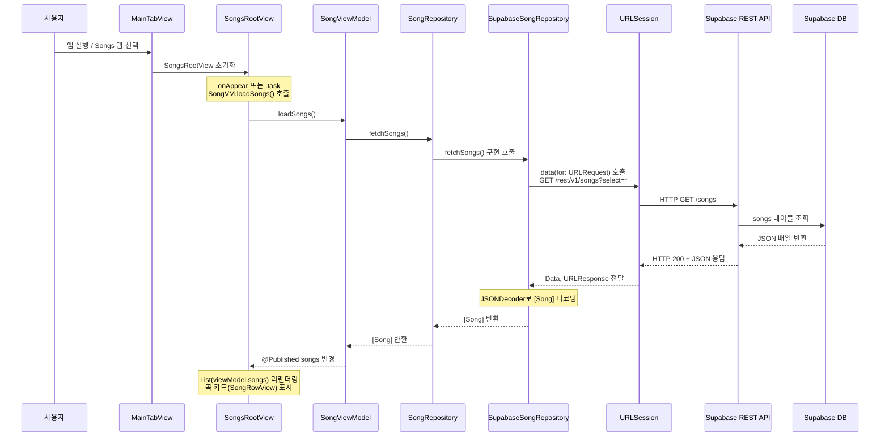
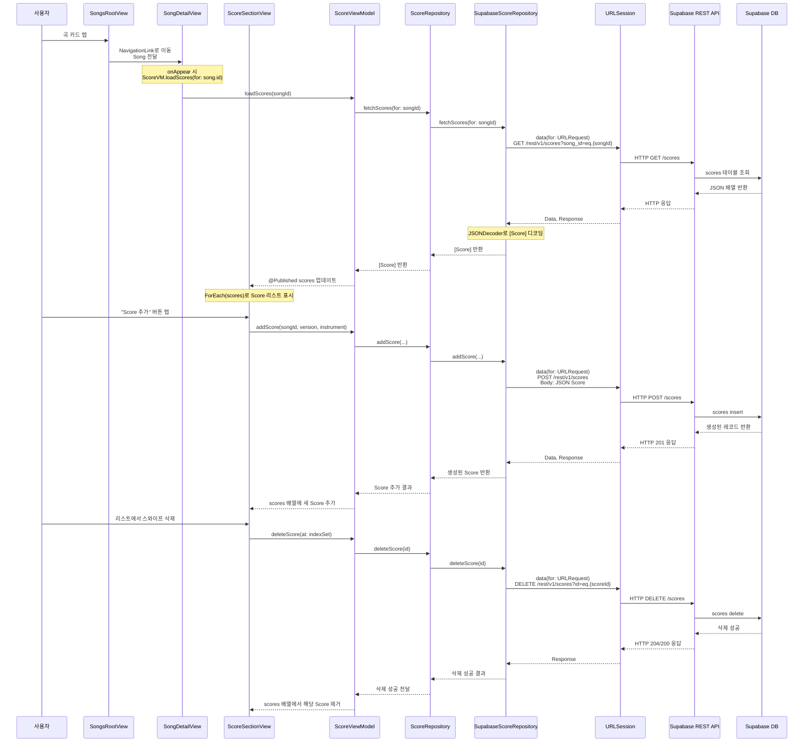
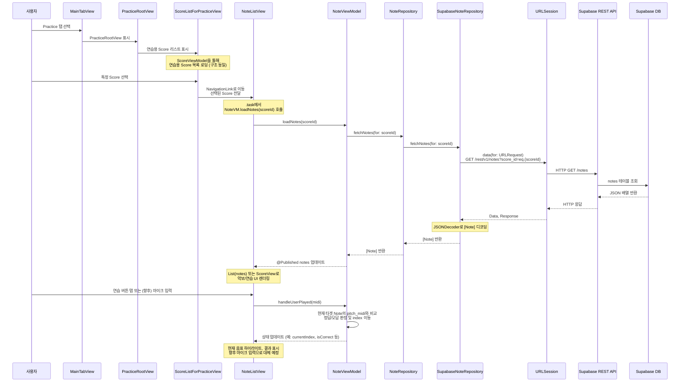
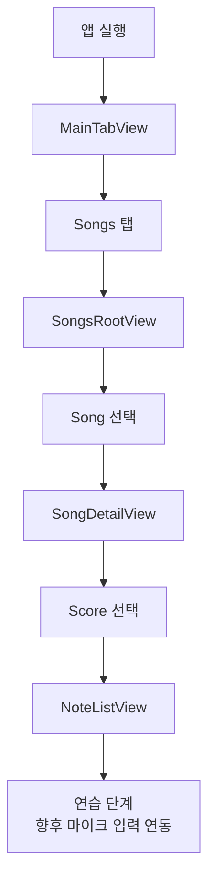
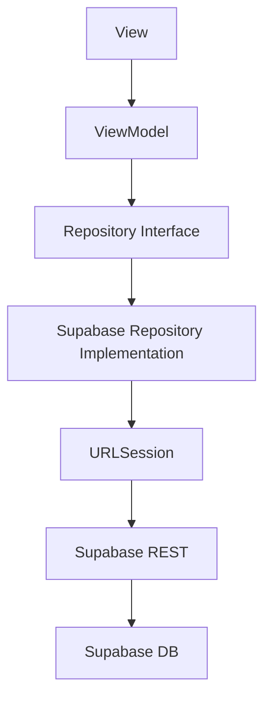

# 🎸 MyGuitar – Supabase 기반 기타 연습 앱

Supabase에 저장된 곡/악보/음표 데이터를 기반으로,
곡 관리 · 악보 관리 · 연습 기능을 제공하는 기타 연습 보조 앱.

- 곡(Song) 조회/추가/삭제
- 악보(Score) 조회/추가/삭제
- 음표(Note) 조회 및 탭 프리뷰
- 연습 화면 제공 (자동 재생 로직 기본 구성)
- 즐겨찾기(Favorites) 제공
- 사용자 설정(Settings) 제공
- 향후 마이크 입력 기반 실시간 연주 인식 기능 제공 예정.

# 🎯 앱 목표

- Supabase에 저장된 곡/악보 데이터를 불러와 보여주기
- 사용자가 직접 곡/악보 메타데이터 추가/삭제할 수 있도록 제공
- 노래 → 악보 → 음표 기반 연습 화면 제공
- 프렛보드 형태의 탭 미리보기 컴포넌트 제공
- 향후 마이크 입력 연결 예정

# 📂 프로젝트 전체 구조
```
MyGuitarApp
├── MyGuitar.xcodeproj                 // Xcode 프로젝트 설정 파일
│
├── MyGuitarApp                        // 실제 앱 소스 루트
│   ├── App
│   │   ├── MainTabView.swift         // 메인 TabView 구성 (Songs / Tuning / Practice / Favorites / Settings)
│   │   └── MyGuitar.swift            // @main 앱 진입점, 다크모드 등 글로벌 설정
│   │
│   ├── Assets.xcassets               // 앱 아이콘, 색상 등 리소스 에셋
│   │
│   ├── Core
│   │   ├── Api
│   │   │   ├── SongApiConfig.example.swift // Supabase 설정 예시 (샘플/템플릿)
│   │   │   └── SongApiConfig.swift         // 실제 Supabase REST API URL / 키 설정
│   │   │
│   │   ├── Model
│   │   │   ├── Note.swift            // notes 테이블 모델, 음표 정보 (start_time, pitch 등)
│   │   │   ├── Score.swift           // scores 테이블 모델, 악보 메타 정보 (버전, 악기 등)
│   │   │   └── Song.swift            // songs 테이블 모델, 곡 기본 정보
│   │   │
│   │   └── Repository
│   │       ├── NoteRepository.swift          // Note 관련 추상 Repository 프로토콜
│   │       ├── ScoreRepository.swift         // Score 관련 추상 Repository 프로토콜
│   │       ├── SongRepository.swift          // Song 관련 추상 Repository 프로토콜
│   │       ├── SupabaseNoteRepository.swift  // Supabase 연동 Note 구현체 (URLSession)
│   │       ├── SupabaseScoreRepository.swift // Supabase 연동 Score 구현체
│   │       └── SupabaseSongRepository.swift  // Supabase 연동 Song 구현체
│   │
│   ├── Features
│   │   ├── Favorites
│   │   │   ├── FavoriteManager.swift // UserDefaults 기반 즐겨찾기 ID 관리 (ObservableObject)
│   │   │   └── FavoritesView.swift   // 즐겨찾기된 Song 리스트 화면
│   │   │
│   │   ├── Notes
│   │   │   └── NoteListView.swift    // 특정 Score의 Note 리스트 및 연습 UI
│   │   │
│   │   ├── Practice
│   │   │   ├── PracticeRootView.swift        // Practice 탭 루트 화면
│   │   │   └── ScoreListForPracticeView.swift// 연습용 Score 선택 리스트
│   │   │
│   │   ├── Scores
│   │   │   ├── ScoreSectionView.swift // SongDetail 안에서 Score 목록/추가/삭제 섹션
│   │   │   └── ScoreView.swift        // Score 전체를 시간 순서대로 시각화하는 뷰
│   │   │
│   │   ├── Settings
│   │   │   └── SettingsView.swift     // 설정 탭, 다크모드 등 앱 설정 UI
│   │   │
│   │   ├── Songs
│   │   │   ├── AddSongView.swift      // 새 곡 추가를 위한 입력 폼 (sheet)
│   │   │   ├── MiniGuitarTabView.swift// 미니 기타 탭 프렛보드 프리뷰 컴포넌트
│   │   │   ├── SongDetailView.swift   // 곡 상세 화면 (정보 + Score 섹션 + 즐겨찾기)
│   │   │   ├── SongRootView.swift     // Songs 탭 루트, 곡 리스트 + Navigation
│   │   │   └── SongRowView.swift      // 곡 리스트의 각 카드 UI (제목 + 미리보기)
│   │   │
│   │   └── Tuning
│   │       └── TuningView.swift       // 튜닝 화면 (현재 파일 손상, UI 예정 위치)
│   │
│   └── ViewModel
│       ├── NoteViewModel.swift        // Note 데이터 로딩, 현재 연습 상태 관리
│       ├── ScoreViewModel.swift       // Score 목록 로딩/추가/삭제 관리
│       ├── SongPreviewModel.swift     // SongRowView용 프리뷰 탭 데이터 생성 모델
│       └── SongViewModel.swift        // Song 목록/추가/삭제 관리 (Supabase 연동)
│
├── MyGuitarAppTests
│   └── MyGuitarAppTests.swift         // 유닛 테스트 코드 (기본 템플릿)
│
├── MyGuitarAppUITests
│   ├── MyGuitarAppUITests.swift       // UI 테스트 코드 (기본 템플릿)
│   └── MyGuitarAppUITestsLaunchTests.swift // 앱 런칭 관련 UI 테스트 템플릿
│
├── .gitignore                         // Git에 올리지 않을 파일 패턴
└── README.md                          // 프로젝트 설명 문서
```

# 🔍 파일별 상세 기능 설명

### 📌App 계층
   
#### MyGuitarApp.swift
- @main 앱 시작점 제공.
- @AppStorage("darkMode") 로 라이트/다크 테마 제공.
- MainTabView 로 앱 UI 전개.
  
#### MainTabView.swift
- TabView 구성 제공.
- Songs / Tuning / Practice / Favorites / Settings 탭 제공.
- 각 탭에 NavigationStack 적용.

### 📌Model 계층

#### Song.swift
- Supabase songs 테이블 매핑 제공.
- id / title / artist / bpm / difficulty / created_at 포함.

#### Score.swift
- Supabase scores 테이블 매핑 제공.
- 특정 곡의 버전/악기 정보 제공.

#### Note.swift
- Supabase notes 테이블 매핑 제공.
- 악보 상세 음표(start_time, duration, pitch_midi 등) 제공.

### 📌Repository 계층

#### SongRepository.swift / ScoreRepository.swift / NoteRepository.swift
- ViewModel이 의존하는 상위 추상화 제공.
- SupabaseSongRepository.swift
- GET / POST / DELETE 구현 제공.

#### SupabaseSongRepository.swift / SupabaseScoreRepository.swift
- GET / POST / DELETE 구현 제공.

#### SupabaseNoteRepository.swift
- 특정 Score의 Note 리스트 로딩 제공.

### 📌ViewModel 계층

#### SongViewModel
- 곡 리스트 로딩 제공.
- 곡 추가/삭제 제공.
- @Published 상태로 View 리렌더링 제공.

#### ScoreViewModel
- Score 목록 로딩 제공.
- Score 추가/삭제 제공.

#### NoteViewModel
- Note 리스트 로딩 제공.
- 현재 연습 중 음표 인덱스 관리 제공.
- 정답 판정 및 자동 진행 로직 제공.

#### SongPreviewModel
- SongRowView에서 사용하는 프렛보드 미리보기 데이터 제공.

### 📌Songs Feature

#### SongsRootView
- Supabase에서 곡 리스트 불러와 표시 제공.
- NavigationLink → SongDetailView 이동 제공.
- 곡 추가 버튼(AddSongView) 제공.

#### SongRowView
- 노래 리스트에서 카드 형태 표시 제공.
- MiniGuitarTabView 프리뷰 제공.

#### SongDetailView
- 곡 상세 정보 제공.
- Score 목록 제공.
- 즐겨찾기 버튼 제공.
- ScoreSectionView 포함.

#### ScoreSectionView
- Score 리스트 표시 제공.
- 추가/삭제 기능 제공.
- NoteListView 연결 제공.

#### AddSongView
- 곡 추가 폼 제공.
- dismiss + onSave 패턴 제공.

### 📌Practice Feature

#### PracticeRootView
- 연습 탭 루트 제공.

#### ScoreListForPracticeView
- 연습 가능한 Score 리스트 제공.

#### ScoreView
- 하나의 악보 전체를 시간 순서대로 시각화 제공.

#### NoteListView
- 연습 메인 화면 제공.
- NoteViewModel 기반 자동 재생 흐름 제공.

#### MiniGuitarTabView
- 하이라이트된 프렛/현 위치 출력 제공.
- SongRowView에서 악보 미리보기로 사용.

### 📌Favorites Feature

#### FavoriteManager
- UserDefaults 기반 즐겨찾기 ID 배열 저장 제공.
- add/remove/isFavorite 지원.

#### FavoritesView
- favorite 목록만 필터링하여 리스트로 표시 제공.

### 📌Settings Feature

#### SettingsView
- 간단한 앱 정보와 다크모드 토글 제공.

# 🔄 Data Flow Diagram

### 곡 목록 로딩 Data Flow


### 곡 상세 + Score CRUD Data Flow


### 연습 탭 / Note 연동 Data Flow


# 👤 User Flow Diagram
전체 흐름: Songs → Detail → Score → Note 연습

# 🏗 Architecture Diagram (MVVM + Repository)

# ⚙ 구현 제공 기능 정리

1. Supabase REST API 연동 제공
2. Song CRUD 제공
3. Score CRUD 제공
4. Note 조회 및 연습 로직 제공
5. Guitar Tab 미리보기 제공
6. Favorites(UserDefaults) 제공
7. Settings(AppStorage) 제공
8. TabView & NavigationStack 제공

# 🚧 향후 제공 예정 기능

- 악보 그래픽 출력 고도화
- 마이크 입력 → pitch 분석 → 자동 진행
