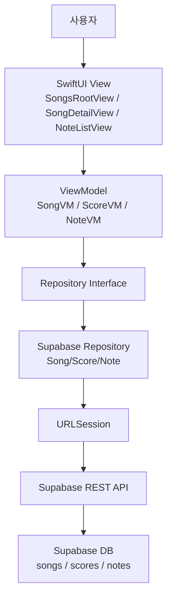
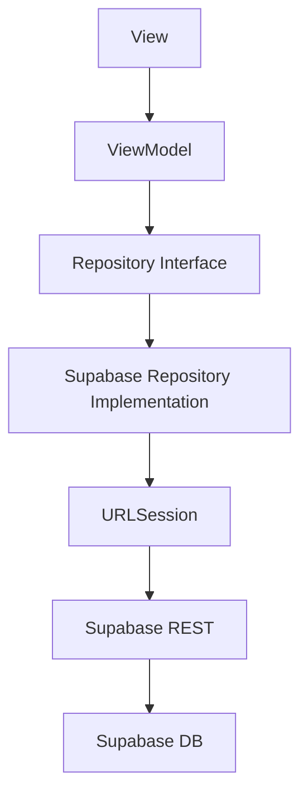

# 🎸 MyGuitar – Supabase 기반 기타 연습 앱

Supabase에 저장된 곡/악보/음표 데이터를 기반으로,
곡 관리 · 악보 관리 · 연습 기능을 제공하는 기타 연습 보조 앱.

- 곡(Song) 조회/추가/삭제
- 악보(Score) 조회/추가/삭제
- 음표(Note) 조회 및 탭 프리뷰
- 연습 화면 제공 (자동 재생 로직 기본 구성)
- 즐겨찾기(Favorites) 제공
- 사용자 설정(Settings) 제공
- 향후 마이크 입력 기반 실시간 연주 인식 기능 제공 예정.

# 🎯 앱 목표

- Supabase에 저장된 곡/악보 데이터를 불러와 보여주기
- 사용자가 직접 곡/악보 메타데이터 추가/삭제할 수 있도록 제공
- 노래 → 악보 → 음표 기반 연습 화면 제공
- 프렛보드 형태의 탭 미리보기 컴포넌트 제공
- 향후 마이크 입력 연결 예정

# 📂 프로젝트 전체 구조
```
MyGuitar
│
├── App
│   ├── MyGuitarApp.swift
│   │   → 앱 진입점. TabView 호출. @AppStorage 기반 다크모드 적용.
│   └── MainTabView.swift
│       → 메인 TabView. Songs / Tuning / Practice / Favorites / Settings 탭 제공.
│
├── Core
│   ├── Model
│   │   ├── Song.swift
│   │   │   → Supabase songs 테이블 모델. CodingKeys 포함.
│   │   ├── Score.swift
│   │   │   → Supabase scores 테이블 모델.
│   │   └── Note.swift
│   │       → Supabase notes 테이블. 악보 음표 정보.
│   │
│   ├── Repository Interface
│   │   ├── SongRepository.swift
│   │   ├── ScoreRepository.swift
│   │   └── NoteRepository.swift
│   │       → ViewModel이 사용하는 추상화 계층.
│   │
│   └── Repository Implementation (Supabase REST API)
│       ├── SupabaseSongRepository.swift
│       ├── SupabaseScoreRepository.swift
│       └── SupabaseNoteRepository.swift
│           → URLSession 기반 Supabase REST API GET/POST/PATCH/DELETE 구현체.
│
├── ViewModel
│   ├── SongViewModel.swift
│   │   → Song CRUD 관리. 목록 로딩 / 추가 / 삭제.
│   ├── ScoreViewModel.swift
│   │   → Score CRUD 관리. 특정 Song의 Score 목록.
│   ├── NoteViewModel.swift
│   │   → Note 조회 및 연습 진행 로직 담당.
│   └── SongPreviewModel.swift
│       → SongRowView에서 사용되는 탭 미리보기 전용 모델.
│
└── Features
    ├── Songs
    │   ├── SongsRootView.swift
    │   │   → 전체 곡 리스트. NavigationLink로 Detail 이동.
    │   ├── SongDetailView.swift
    │   │   → 곡 상세. Score 목록, 곡 정보 표시, 즐겨찾기 제공.
    │   ├── SongRowView.swift
    │   │   → 리스트 카드 UI. Mini 탭 프리뷰 포함.
    │   ├── ScoreSectionView.swift
    │   │   → SongDetail 내부 Score 목록 섹션.
    │   ├── AddSongView.swift
    │   │   → 곡 추가 폼.
    │   └── SongRoot 관련 보조 UI들
    │
    ├── Practice
    │   ├── PracticeRootView.swift
    │   │   → 연습 탭 루트. Score 리스트 제공.
    │   ├── ScoreListForPracticeView.swift
    │   │   → 연습 가능한 Score 리스트.
    │   ├── ScoreView.swift
    │   │   → 전체 악보를 시간 순서대로 표시.
    │   ├── NoteListView.swift
    │   │   → 실제 연습 화면. NoteViewModel 사용. 자동 재생 및 정답 판정 로직 포함.
    │   ├── MiniGuitarTabView.swift
    │   │   → 미니 탭 프렛보드 표시 뷰. SongRowView에서 미리보기로 사용.
    │   └── ScoreSectionView.swift (공유)
    │
    ├── Tuning
    │   └── TuningView.swift (현재 파일 손상 → 복원 필요)
    │
    ├── Favorites
    │   ├── FavoriteManager.swift
    │   │   → UserDefaults 기반 즐겨찾기 저장.
    │   └── FavoritesView.swift
    │       → 즐겨찾기 Song 필터링 리스트 제공.
    │
    └── Settings
        └── SettingsView.swift
            → 다크모드 및 앱 정보 제공.
```

# 🔍 파일별 상세 기능 설명

#### App 계층
   
- MyGuitarApp.swift
1. @main 앱 시작점 제공.
2. @AppStorage("darkMode") 로 라이트/다크 테마 제공.
3. MainTabView 로 앱 UI 전개.
  
- MainTabView.swift
1. TabView 구성 제공.
2. Songs / Tuning / Practice / Favorites / Settings 탭 제공.
3. 각 탭에 NavigationStack 적용.

#### Model 계층

- Song.swift
1. Supabase songs 테이블 매핑 제공.
2. id / title / artist / bpm / difficulty / created_at 포함.

- Score.swift
1. Supabase scores 테이블 매핑 제공.
2. 특정 곡의 버전/악기 정보 제공.

- Note.swift
1. Supabase notes 테이블 매핑 제공.
2. 악보 상세 음표(start_time, duration, pitch_midi 등) 제공.

#### Repository 계층

- SongRepository.swift / ScoreRepository.swift / NoteRepository.swift
1. ViewModel이 의존하는 상위 추상화 제공.
2. SupabaseSongRepository.swift
3. GET / POST / DELETE 구현 제공.

- SupabaseScoreRepository.swift
1. GET / POST / DELETE 구현 제공.

- SupabaseNoteRepository.swift
1. 특정 Score의 Note 리스트 로딩 제공.

#### ViewModel 계층

- SongViewModel
1. 곡 리스트 로딩 제공.
2. 곡 추가/삭제 제공.
3. @Published 상태로 View 리렌더링 제공.

- ScoreViewModel
1. Score 목록 로딩 제공.
2. Score 추가/삭제 제공.

- NoteViewModel
1. Note 리스트 로딩 제공.
2. 현재 연습 중 음표 인덱스 관리 제공.
3. 정답 판정 및 자동 진행 로직 제공.

- SongPreviewModel
1. SongRowView에서 사용하는 프렛보드 미리보기 데이터 제공.

#### Songs Feature

- SongsRootView
1. Supabase에서 곡 리스트 불러와 표시 제공.
2. NavigationLink → SongDetailView 이동 제공.
3. 곡 추가 버튼(AddSongView) 제공.

- SongRowView
1. 노래 리스트에서 카드 형태 표시 제공.
2. MiniGuitarTabView 프리뷰 제공.

- SongDetailView
1. 곡 상세 정보 제공.
2. Score 목록 제공.
3. 즐겨찾기 버튼 제공.
4. ScoreSectionView 포함.

- ScoreSectionView
1. Score 리스트 표시 제공.
2. 추가/삭제 기능 제공.
3. NoteListView 연결 제공.

- AddSongView
1. 곡 추가 폼 제공.
2. dismiss + onSave 패턴 제공.

#### Practice Feature

- PracticeRootView
1. 연습 탭 루트 제공.

- ScoreListForPracticeView
1. 연습 가능한 Score 리스트 제공.

- ScoreView
1. 하나의 악보 전체를 시간 순서대로 시각화 제공.

- NoteListView
1. 연습 메인 화면 제공.
2. NoteViewModel 기반 자동 재생 흐름 제공.

- MiniGuitarTabView
1. 하이라이트된 프렛/현 위치 출력 제공.
2. SongRowView에서 악보 미리보기로 사용.

#### Favorites Feature

- FavoriteManager
1. UserDefaults 기반 즐겨찾기 ID 배열 저장 제공.
2. add/remove/isFavorite 지원.

- FavoritesView
1. favorite 목록만 필터링하여 리스트로 표시 제공.

#### Settings Feature

- SettingsView
1. 간단한 앱 정보와 다크모드 토글 제공.

# 🔄 Data Flow Diagram

# 👤 User Flow Diagram
전체 흐름: Songs → Detail → Score → Note 연습
```mermaid
flowchart TD

A[앱 실행] --> B[MainTabView]
B --> C[Songs 탭]
C --> D[SongsRootView]
D --> E[Song 선택]
E --> F[SongDetailView]
F --> G[Score 선택]
G --> H[NoteListView]
H --> I[연습 → 자동 진행(향후 마이크 입력)]
```
# 🏗 Architecture Diagram (MVVM + Repository)

# ⚙ 구현 제공 기능 정리

1. Supabase REST API 연동 제공
2. Song CRUD 제공
3. Score CRUD 제공
4. Note 조회 및 연습 로직 제공
5. Guitar Tab 미리보기 제공
6. Favorites(UserDefaults) 제공
7. Settings(AppStorage) 제공
8. TabView & NavigationStack 제공

# 🚧 향후 제공 예정 기능

- 악보 그래픽 출력 고도화
- 마이크 입력 → pitch 분석 → 자동 진행
