# 🎸 MyGuitar – Supabase 기반 기타 연습 앱

Supabase에 저장된 곡/악보/음표 데이터를 기반으로,
곡 관리 · 악보 관리 · 연습 기능을 제공하는 기타 연습 보조 앱.

- 곡(Song) 조회/추가/삭제
- 악보(Score) 조회/추가/삭제
- 음표(Note) 조회 및 탭 프리뷰
- 연습 화면 제공 (자동 재생 로직 기본 구성)
- 즐겨찾기(Favorites) 제공
- 사용자 설정(Settings) 제공
- 향후 마이크 입력 기반 실시간 연주 인식 기능 제공 예정.

# 🎯 앱 목표

- Supabase에 저장된 곡/악보 데이터를 불러와 보여주기
- 사용자가 직접 곡/악보 메타데이터 추가/삭제할 수 있도록 제공
- 노래 → 악보 → 음표 기반 연습 화면 제공
- 프렛보드 형태의 탭 미리보기 컴포넌트 제공
- 향후 마이크 입력 연결 예정

# 📂 프로젝트 전체 구조
```
MyGuitarApp
├── MyGuitar.xcodeproj                 // Xcode 프로젝트 설정 파일
│
├── MyGuitarApp                        // 실제 앱 소스 루트
│   ├── App
│   │   ├── MainTabView.swift         // 메인 TabView 구성 (Songs / Tuning / Practice / Favorites / Settings)
│   │   └── MyGuitar.swift            // @main 앱 진입점, 다크모드 등 글로벌 설정
│   │
│   ├── Assets.xcassets               // 앱 아이콘, 색상 등 리소스 에셋
│   │
│   ├── Core
│   │   ├── Api
│   │   │   ├── SongApiConfig.example.swift // Supabase 설정 예시 (샘플/템플릿)
│   │   │   └── SongApiConfig.swift         // 실제 Supabase REST API URL / 키 설정
│   │   │
│   │   ├── Model
│   │   │   ├── Note.swift            // notes 테이블 모델, 음표 정보 (start_time, pitch 등)
│   │   │   ├── Score.swift           // scores 테이블 모델, 악보 메타 정보 (버전, 악기 등)
│   │   │   └── Song.swift            // songs 테이블 모델, 곡 기본 정보
│   │   │
│   │   └── Repository
│   │       ├── NoteRepository.swift          // Note 관련 추상 Repository 프로토콜
│   │       ├── ScoreRepository.swift         // Score 관련 추상 Repository 프로토콜
│   │       ├── SongRepository.swift          // Song 관련 추상 Repository 프로토콜
│   │       ├── SupabaseNoteRepository.swift  // Supabase 연동 Note 구현체 (URLSession)
│   │       ├── SupabaseScoreRepository.swift // Supabase 연동 Score 구현체
│   │       └── SupabaseSongRepository.swift  // Supabase 연동 Song 구현체
│   │
│   ├── Features
│   │   ├── Favorites
│   │   │   ├── FavoriteManager.swift // UserDefaults 기반 즐겨찾기 ID 관리 (ObservableObject)
│   │   │   └── FavoritesView.swift   // 즐겨찾기된 Song 리스트 화면
│   │   │
│   │   ├── Notes
│   │   │   └── NoteListView.swift    // 특정 Score의 Note 리스트 및 연습 UI
│   │   │
│   │   ├── Practice
│   │   │   ├── PracticeRootView.swift        // Practice 탭 루트 화면
│   │   │   └── ScoreListForPracticeView.swift// 연습용 Score 선택 리스트
│   │   │
│   │   ├── Scores
│   │   │   ├── ScoreSectionView.swift // SongDetail 안에서 Score 목록/추가/삭제 섹션
│   │   │   └── ScoreView.swift        // Score 전체를 시간 순서대로 시각화하는 뷰
│   │   │
│   │   ├── Settings
│   │   │   └── SettingsView.swift     // 설정 탭, 다크모드 등 앱 설정 UI
│   │   │
│   │   ├── Songs
│   │   │   ├── AddSongView.swift      // 새 곡 추가를 위한 입력 폼 (sheet)
│   │   │   ├── MiniGuitarTabView.swift// 미니 기타 탭 프렛보드 프리뷰 컴포넌트
│   │   │   ├── SongDetailView.swift   // 곡 상세 화면 (정보 + Score 섹션 + 즐겨찾기)
│   │   │   ├── SongRootView.swift     // Songs 탭 루트, 곡 리스트 + Navigation
│   │   │   └── SongRowView.swift      // 곡 리스트의 각 카드 UI (제목 + 미리보기)
│   │   │
│   │   └── Tuning
│   │       └── TuningView.swift       // 튜닝 화면 (현재 파일 손상, UI 예정 위치)
│   │
│   └── ViewModel
│       ├── NoteViewModel.swift        // Note 데이터 로딩, 현재 연습 상태 관리
│       ├── ScoreViewModel.swift       // Score 목록 로딩/추가/삭제 관리
│       ├── SongPreviewModel.swift     // SongRowView용 프리뷰 탭 데이터 생성 모델
│       └── SongViewModel.swift        // Song 목록/추가/삭제 관리 (Supabase 연동)
│
├── MyGuitarAppTests
│   └── MyGuitarAppTests.swift         // 유닛 테스트 코드 (기본 템플릿)
│
├── MyGuitarAppUITests
│   ├── MyGuitarAppUITests.swift       // UI 테스트 코드 (기본 템플릿)
│   └── MyGuitarAppUITestsLaunchTests.swift // 앱 런칭 관련 UI 테스트 템플릿
│
├── .gitignore                         // Git에 올리지 않을 파일 패턴
└── README.md                          // 프로젝트 설명 문서
```

# 🔍 파일별 상세 기능 설명

### 📌 App 계층

#### MyGuitarApp.swift
- 앱 전체의 @main 시작점 제공.
- @AppStorage("darkMode") 로 전역 라이트/다크 테마 적용.
- WindowGroup 내부에서 MainTabView() 호출하여 전체 UI 전개.
- SwiftUI 환경값 설정의 루트 역할 수행.

#### MainTabView.swift
- 앱의 핵심 구조인 TabView 구성 제공.
- Songs / Tuning / Practice / Favorites / Settings 총 5개 탭 제공.
- 각 탭 화면은 자체적으로 NavigationStack을 포함하여 화면 이동 지원.
- 앱 전체 네비게이션 구조의 뼈대 역할.

### 📌 Model 계층

#### Song.swift
- Supabase songs 테이블과 1:1 매핑되는 데이터 모델.
- title, artist, bpm, difficulty, createdAt 등 기본 필드 보유.
- Codable + Identifiable 지원하여 네트워크 디코딩 및 SwiftUI 리스트에서 사용.

#### Score.swift
- Supabase scores 테이블 모델.
- version, instrument, order, songId 필드 보유.
- 특정 곡(Song)에 속한 악보 버전 메타데이터 표현.

#### Note.swift
- Supabase notes 테이블 모델.
- start_time, duration, pitch_midi, string_num, fret 등 악보 상세 음표 정보 포함.
- 연습 화면의 시간 기반 재생 및 판단 로직의 핵심 데이터.

### 📌 Repository 계층

#### SongRepository.swift / ScoreRepository.swift / NoteRepository.swift
- MVVM 계층 분리 원칙을 위한 추상화 인터페이스 제공.
- ViewModel은 구현체가 아니라 프로토콜에 의존 → 테스트 용이 / 교체 용이.

#### SupabaseSongRepository.swift
- SongRepository 실제 구현.
- URLSession으로 Supabase REST API 호출 (GET/POST/DELETE).
- 데이터 JSON decoder → Song 배열로 변환하여 반환.

#### SupabaseScoreRepository.swift
- ScoreRepository 구현체.
- 특정 Song에 속한 Score 목록 로딩, 생성, 삭제 처리.
- Data Flow: ScoreSectionView → ScoreViewModel → ScoreRepository → Supabase.

#### SupabaseNoteRepository.swift
- 특정 Score의 Note 리스트 로딩 제공 (GET /notes).
- 연습 화면에서 NoteViewModel이 이 구현체를 사용하여 데이터 초기화.

### 📌 ViewModel 계층

#### SongViewModel
- 곡 리스트 로딩(loadSongs) 제공.
- SupabaseSongRepository를 통해 CRUD 수행.
- 곡 추가(addSong), 삭제(deleteSong) 기능 제공.
- @Published songs → SongsRootView가 자동 리렌더링.

#### ScoreViewModel
- 특정 Song에 속한 Score 목록 로딩(loadScores) 기능 제공.
- Score 추가(addScore) 및 삭제(deleteScore) 제공.
- ScoreSectionView가 사용하는 데이터 소스 역할.

#### NoteViewModel
- 특정 Score의 Note 리스트 로딩(loadNotes) 제공.
- 현재 연습 중 음표 index 관리.
- handleUserPlayed(midi) 로 사용자 입력 판정 → 자동 진행 로직 제공.
- Practice 기능 전체를 관장하는 핵심 로직.

#### SongPreviewModel
- SongRowView에서 사용되는 “미니 탭 프리뷰” 데이터 생성.
- 첫 수 음표만 추출하여 MiniGuitarTabView에 표시.

### 📌 Songs Feature (곡 관리 전체)

#### SongsRootView
- Songs 탭 메인 화면.
- onAppear/.task 에서 SongViewModel.loadSongs() 호출 → Supabase fetch.
- List 형태로 곡 목록 표시.
- 곡 선택 시 → SongDetailView 로 Navigation.
- 오른쪽 + 버튼으로 AddSongView sheet 표시.

#### SongRowView
- 곡 리스트에서 카드 형태 UI 제공.
- 제목/아티스트 + 프리뷰 악보 표시.
- SongPreviewModel로 미리보기 데이터 생성 → MiniGuitarTabView에 표시.

#### SongDetailView
- 선택된 Song의 상세 정보 출력.
- onAppear에서 ScoreViewModel.loadScores() 실행 → Score 목록 로딩.
- 즐겨찾기 버튼(FavoriteManager 연동) 제공.
- ScoreSectionView 포함 → Score CRUD 화면을 구성.

#### ScoreSectionView
- Score 리스트 UI 섹션.
- Score 추가(addScore) / 삭제(deleteScore) 기능 제공.
- 각 Score 선택 시 NoteListView(연습 화면)로 이동.
- Data Flow: ScoreSectionView → ScoreViewModel → SupabaseScoreRepository.

#### AddSongView
- 신규 곡 입력 폼 제공.
- 제목/아티스트/BPM/난이도 입력.
- onSave 콜백으로 SongViewModel.addSong 호출.
- sheet dismiss 로 화면 복귀.

### 📌 Practice Feature (연습 기능 전체)

#### PracticeRootView
- Practice 탭 루트 화면.
- ScoreListForPracticeView 를 포함하여 연습 가능한 Score 목록 표시.

#### ScoreListForPracticeView
- SupabaseScoreRepository를 통해 로딩된 Score 목록 표시.
- Score 선택 시 NoteListView로 이동.

#### ScoreView
- Notes를 타임라인 기반으로 전체 악보처럼 시각화.
- 향후 그래픽 악보 UI로 확장 예정.

#### NoteListView
- 연습 메인 화면.
- NoteViewModel.loadNotes(scoreId) 로 Note 로딩.
- currentIndex 기반으로 현재 연습할 음 하이라이트.
- handleUserPlayed(midi)로 정답 판정 → 다음 음으로 자동 진행.
- 향후 마이크 입력 흐름과 연결될 핵심 UI.

#### MiniGuitarTabView
- 프렛보드 작은 버전 표시.
- 특정 fret/string 조합을 하이라이트.
- SongRowView의 악보 미리보기에도 사용됨.

### 📌 Favorites Feature

#### FavoriteManager
- UserDefaults 기반 즐겨찾기 Song ID 배열 저장/로드.
- toggle(id), isFavorite(id) 제공.
- SongDetailView 및 FavoritesView와 연동.

#### FavoritesView

- 전체 Song 목록에서 FavoriteManager 기반으로 즐겨찾기만 필터링.
- NavigationLink로 다시 SongDetailView로 이동 가능.

### 📌 Settings  Feature

#### SettingsView
- 앱 정보 및 설정 화면 제공.
- @AppStorage 기반 다크모드 토글 제공.
- MyGuitarApp.swift와 연동되어 앱 전체 테마 변경.

### 📌 Tuning Feature

#### TuningView.swift
- 기타 튜닝 화면 담당.
- 현재 손상된 상태이지만 구조 상 “튜닝 기능 자리”를 담당하는 파일.
- TabView의 Tuning 탭에 해당하는 UI.

# 🔄 Data Flow Diagram

### 곡 목록 로딩 Data Flow


### 곡 상세 + Score CRUD Data Flow

```mermaid
sequenceDiagram
    participant User as 사용자
    participant SongsRootView as SongsRootView
    participant SongDetailView as SongDetailView
    participant ScoreSectionView as ScoreSectionView
    participant ScoreVM as ScoreViewModel
    participant ScoreRepo as ScoreRepository
    participant ScRepo as SupabaseScoreRepository
    participant URLS as URLSession
    participant API as Supabase REST API
    participant DB as Supabase DB

    User->>SongsRootView: 곡 카드 탭
    SongsRootView->>SongDetailView: NavigationLink로 이동<br/>Song 전달

    Note over SongDetailView: onAppear 시<br/>ScoreVM.loadScores(for: song.id)

    SongDetailView->>ScoreVM: loadScores(songId)
    ScoreVM->>ScoreRepo: fetchScores(for: songId)
    ScoreRepo->>ScRepo: fetchScores(for: songId)

    ScRepo->>URLS: data(for: URLRequest)<br/>GET /rest/v1/scores?song_id=eq.{songId}
    URLS->>API: HTTP GET /scores
    API->>DB: scores 테이블 조회
    DB-->>API: JSON 배열 반환
    API-->>URLS: HTTP 응답
    URLS-->>ScRepo: Data, Response

    Note over ScRepo: JSONDecoder로 [Score] 디코딩

    ScRepo-->>ScoreRepo: [Score] 반환
    ScoreRepo-->>ScoreVM: [Score] 반환
    ScoreVM-->>ScoreSectionView: @Published scores 업데이트

    Note over ScoreSectionView: ForEach(scores)로 Score 리스트 표시

    %% Score 추가 흐름
    User->>ScoreSectionView: "Score 추가" 버튼 탭
    ScoreSectionView->>ScoreVM: addScore(songId, version, instrument)
    ScoreVM->>ScoreRepo: addScore(...)
    ScoreRepo->>ScRepo: addScore(...)

    ScRepo->>URLS: data(for: URLRequest)<br/>POST /rest/v1/scores<br/>Body: JSON Score
    URLS->>API: HTTP POST /scores
    API->>DB: scores insert
    DB-->>API: 생성된 레코드 반환
    API-->>URLS: HTTP 201 응답
    URLS-->>ScRepo: Data, Response

    ScRepo-->>ScoreRepo: 생성된 Score 반환
    ScoreRepo-->>ScoreVM: Score 추가 결과
    ScoreVM-->>ScoreSectionView: scores 배열에 새 Score 추가

    %% Score 삭제 흐름
    User->>ScoreSectionView: 리스트에서 스와이프 삭제
    ScoreSectionView->>ScoreVM: deleteScore(at: indexSet)
    ScoreVM->>ScoreRepo: deleteScore(id)
    ScoreRepo->>ScRepo: deleteScore(id)

    ScRepo->>URLS: data(for: URLRequest)<br/>DELETE /rest/v1/scores?id=eq.{scoreId}
    URLS->>API: HTTP DELETE /scores
    API->>DB: scores delete
    DB-->>API: 삭제 성공
    API-->>URLS: HTTP 204/200 응답
    URLS-->>ScRepo: Response

    ScRepo-->>ScoreRepo: 삭제 성공 결과
    ScoreRepo-->>ScoreVM: 삭제 성공 전달
    ScoreVM-->>ScoreSectionView: scores 배열에서 해당 Score 제거
```


### 연습 탭 / Note 연동 Data Flow

```mermaid
sequenceDiagram
    participant User as 사용자
    participant MainTabView as MainTabView
    participant PracticeRoot as PracticeRootView
    participant ScoreList as ScoreListForPracticeView
    participant NoteListView as NoteListView
    participant NoteVM as NoteViewModel
    participant NoteRepo as NoteRepository
    participant NtRepo as SupabaseNoteRepository
    participant URLS as URLSession
    participant API as Supabase REST API
    participant DB as Supabase DB

    User->>MainTabView: Practice 탭 선택
    MainTabView->>PracticeRoot: PracticeRootView 표시
    PracticeRoot->>ScoreList: 연습용 Score 리스트 표시

    Note over ScoreList: ScoreViewModel을 통해<br/>연습용 Score 목록 로딩 (구조 동일)

    User->>ScoreList: 특정 Score 선택
    ScoreList->>NoteListView: NavigationLink로 이동<br/>선택된 Score 전달

    Note over NoteListView: .task에서<br/>NoteVM.loadNotes(scoreId) 호출

    NoteListView->>NoteVM: loadNotes(scoreId)
    NoteVM->>NoteRepo: fetchNotes(for: scoreId)
    NoteRepo->>NtRepo: fetchNotes(for: scoreId)

    NtRepo->>URLS: data(for: URLRequest)<br/>GET /rest/v1/notes?score_id=eq.{scoreId}
    URLS->>API: HTTP GET /notes
    API->>DB: notes 테이블 조회
    DB-->>API: JSON 배열 반환
    API-->>URLS: HTTP 응답
    URLS-->>NtRepo: Data, Response

    Note over NtRepo: JSONDecoder로 [Note] 디코딩

    NtRepo-->>NoteRepo: [Note] 반환
    NoteRepo-->>NoteVM: [Note] 반환
    NoteVM-->>NoteListView: @Published notes 업데이트

    Note over NoteListView: List(notes) 또는 ScoreView로<br/>악보/연습 UI 렌더링

    %% 연습 진행(사용자 입력 → 정답 판정) 흐름
    User->>NoteListView: 연습 버튼 탭 또는 (향후) 마이크 입력
    NoteListView->>NoteVM: handleUserPlayed(midi)
    NoteVM->>NoteVM: 현재 타겟 Note의 pitch_midi와 비교<br/>정답/오답 판정 및 index 이동
    NoteVM-->>NoteListView: 상태 업데이트 (예: currentIndex, isCorrect 등)

    Note over NoteListView: 현재 음표 하이라이트, 결과 표시<br/>향후 마이크 입력으로 대체 예정
```


# 👤 User Flow Diagram
전체 흐름: Songs → Detail → Score → Note 연습

```mermaid
flowchart TD

A[앱 실행] --> B[MainTabView]
B --> C[Songs 탭]
C --> D[SongsRootView]
D --> E[Song 선택]
E --> F[SongDetailView]
F --> G[Score 선택]
G --> H[NoteListView]
H --> I[연습 단계<br/>향후 마이크 입력 연동]
```

# 🏗 Architecture Diagram (MVVM + Repository)

# ⚙ 구현 제공 기능 정리

1. Supabase REST API 연동 제공
2. Song CRUD 제공
3. Score CRUD 제공
4. Note 조회 및 연습 로직 제공
5. Guitar Tab 미리보기 제공
6. Favorites(UserDefaults) 제공
7. Settings(AppStorage) 제공
8. TabView & NavigationStack 제공

# 🚧 향후 제공 예정 기능

- 악보 그래픽 출력 고도화
- 마이크 입력 → pitch 분석 → 자동 진행
